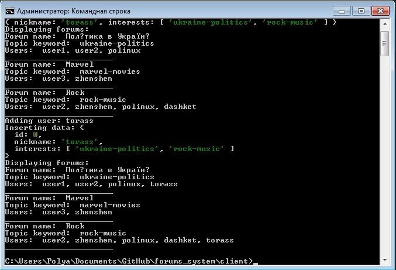

# 3-а лабораторна робота

###### Система форумів, де користувачі спілкуються на довільні теми. Кожен з форумів має тематику, визначену ключовим словом. Користувачі підписані на оновлення в форумах, у яких вони зацікавлені. 

Система форумів з наступними сценаріями:

1. Переглянути список наявних форумів.
2. Зареєструвати нового користувача, вказуючи його нікнейм та інтереси. Інтереси представляються у вигляді списка ключових слів, які співпадають з темами форумів.

Приклад виконання сценаріїв



- Сервер запускається командою
```shell script
go run ./cmd/server
```
з директорії `server`.

- Приклади реалізації сценаріїв на базі клієнтського SDK запускаються через команду
```shell script
npm install
node examples.js
```
з директорії `client`.

- Папка `db` містить SQL скрипти для ініціалізації БД сервера.

